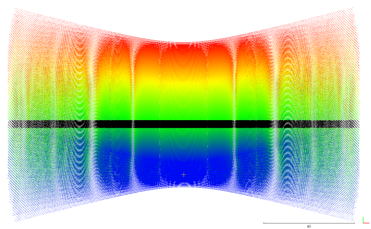
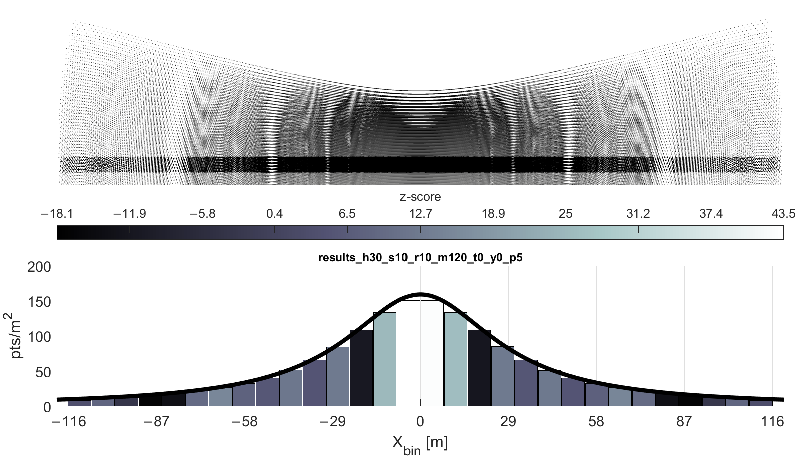

# pucksim
A sensor modeling suite for the Velodyne VLP-16 PUCK laser scanner written in MATLAB.


*Vizualization of changes in coverage gap pattern when altering flying height, forward speed, and rotation rate of scanner. [Link to video](supplemental/pucksim_video_inspection.mp4)*

## Overview
Many lightweight laser scanners used for UAS lidar mapping emply a multi-beam, "fan-style" scanner; the Velodyne VLP-16 PUCK laser scanner is among the most popular. The multibeam "fan-style" scanner, despite its high sampling rate, can create a non-uniform coverage of footprints—in other words, coverage gaps.


These gaps are a result of a clustering of laser pulses, where many scan lines from multiple passes of the fan of lasers intersect at a node, effecively clustering the resulting returns and leaving the area around the node without sufficient coverage.

The software presented here was created to examine the scan pattern of the VLP‐16 both qualitatively—i.e., manually examining simulated point clouds—and quantitatively, via spatial statistics. The outputs can be examined in point cloud viewing software such as CloudCompare, and the histograms of the spatial statistics are output as PNGs.

This software was written by an over-caffeinated graduate student version of myself in 2017. I would love nothing more than to treat this all to a thorough code refactoring, but life moves on and so must my research. I present this work as-is.

## More information

Development of the software and analysis of the VLP-16 scan pattern is discussed extensively here:

> Lassiter HA, Whitley T, Wilkinson B, Abd-Elrahman A. Scan Pattern Characterization of Velodyne VLP-16 Lidar Sensor for UAS Laser Scanning. Sensors. 2020; 20(24):7351. https://doi.org/10.3390/s20247351

I presented results on this study at the ASPRS Annual Conference in 2018. Those slides can be found [here](/supplemental).

## How to use
- Use `puckSim()` to create a simulated point cloud at given flight parameters.
- *(optional)* Use `puckOverlap()` on the simulated point cloud from `puckSim()` to simulate a typical serpentine flying pattern of parallel flight lines resulting in overlapping swaths of lidar coverage.
- Use `puckStats()` to analyze the spatial statistics of the simulated point cloud, **or**
- Use `gap_plot_script` to augment the graphical output of `puckStats()` with the results of the gap characterization equations presented in the study.

Details on each of the three MATLAB scripts are given below.

## puckSim.m
`puckSim()` simulates the point cloud of a UAS-mounted Velodyne PUCK VLP-16 Laser Scanner.

This function models the VLP-16 scanner as a point moving parallel to a target plane (specified in puckInt.m) at the specified flying height. The laser returns are modeled by lines with a known direction passing through the scanner point and intersecting the target plane.

The scanner is assumed to be oriented such that its +z-axis is coincidentwith the direction of travel, which has been arbitrarily chosen to be the +Y direction in object space. The scanner's y-axis is coincident with the -Z direction in object space. This can be manipulated as described below.

`puckSim(height, speed)` outputs a text file that records the intersections of the modeled laser returns with the target plane. These inputs are required. A speed of 0 (zero) will model a single rotation of the scanner head.

`puckSim(height, speed, 'rotationRate', R)` changes the rotation rate of the scanner head. By default, the rotation rate `R` is set to 10 Hz. The VLP-16 manual indicates the rotation rate can vary between 5-20 Hz (p.20).

`puckSim(height, speed, 'profile', L)` outputs a profile that shows the area of the target plane that was "fully illuninated," i.e. an area that was struck by lasers from all 16 channels. This profile is a "strip" of points `L` meters long in the direction of flight. This profile can be used to represent theoretical point density of a strip for a flight over an unobstructed target plane.

`puckSim(height, speed, 'maxRange', M)` limits the maximum range of recorded returns to `M` meters. The VLP-16 records returns up to 120 m, the default value for `maxRange`.

`puckSim(height, speed, 'tilt', T)` changes the orientation of the scanner. By default, the scanner is oriented as described above; this can also be thought of as the scanner at nadir, or facing down. (More formally, this is a rotation of -90° about the scanner's x-axis.)

`puckSim(height, speed, 'yaw', Y)` changes the orientation of the scanner about the airframe's +Z-axis. This is useful for simulating crab.

Example:
```
% Get a 5-m profile of points collected from a flying height of 50 m, 
% forward speed of 10 m/s, and a rotation rate of 20 Hz, with the scanner
% inclined 15° from nadir (-75° about its x-axis), and the aircraft
% crabbing at -5°. Limit range to 60 m.

puckSim(50, 10, 'rotationRate', 20, 'profile', 5, 'maxRange', 60, ...
    'tilt', 15, 'yaw', -5)

% Output saved to results_h50_s10_r20_m60_t15_y-5_p5.txt.
```



*A "fully illuminated" profile (black) within a short swath of a simulated point cloud (color scale = time: blue > red).*

## puckOverlap.m
`puckOverlap(infile, width)` produces a point cloud that simulates three overlapping passes by a UAS-mounted Velodyne PUCK(TM) VLP-16 Laser Scanner. The input must be the output from `puckSim()`, which is the result of simulating a single pass by the UAS-mounted PUCK. The two passes will be parallel, opposite in direction, and separated by some `width` (in meters).

The name of the output file from the last run of `puckSim()` in the current session will be saved in the base workspace as `simfile`.

Example:
```
% Simulate overlapping passes whose flight lines are parallel, opposite
% in direction, and separated by 50 m. The name of the output file from 
% PUCKSIM is in the workspace as 'simfile'.

puckOverlap(simfile, 50)

% Output saved to overlap_*.txt, where * = simfile (sans file ext.).
```

## puckStats.m

`puckStats(infile)` calculates spatial statistics on a point cloud generated by `puckSim()` or `puckOverlap()`.

It is recommended to use this function on a point cloud "profile" (for more info on profile, type `help puckSim` in the MATLAB terminal or [see above](#puckSIM.m)). This will eliminate edge effects and reduce runtime significantly. The input must be the output from `puckSim()` or `puckOverlap()` or identically formatted.

The name of the output file from the last run of PUCKSIM in the current session will be saved in the base workspace as `simfile`. The name of the output file from the last run of PUCKOVERLAP in the current session will be saved in the base workspace as `overlapfile`.

WARNING: For each bin, a square distance matrix must be computed in order to run the spatial analysis. Executing PUCKSTATS with too few bins could lead to memory issues. At least 80 bins are recommended for analyzing an overlap file.

Reference on spataial statistics method used [available here](http://pro.arcgis.com/en/pro-app/tool-reference/spatial-statistics/h-how-average-nearest-neighbor-distance-spatial-st.htm).


*A short swath of simulated lidar data with a five-meter profile highlighted in black; below, sample output from the `puckStats() `function.*

## gap_plot_script.m

This script overlays the results of the gap characterization equations presented in the article referenced above. 


*Point cloud profile exaggerated along Y-axis to show detail.*


*Output of `puckStats()` with gap characterization equation reults shown in blue along X-axis.]*

## Bonus: puckPlan

During our initial testing of a UAS lidar payload our team, the [UFUAS Research Program](https://uas.ifas.ufl.edu/), was building and studying, we encountered issues with the mission planning software we had at our disposal via DJI. I whipped up a quick script to plan our flights and output them into useable formats.


*An oblique view of KML flight plans for Ben Hill Griffin Stadium in Gainesville, Florida, USA, created with `puckPlan()`.*